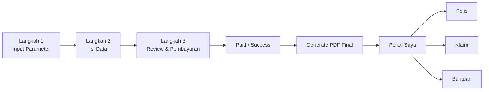
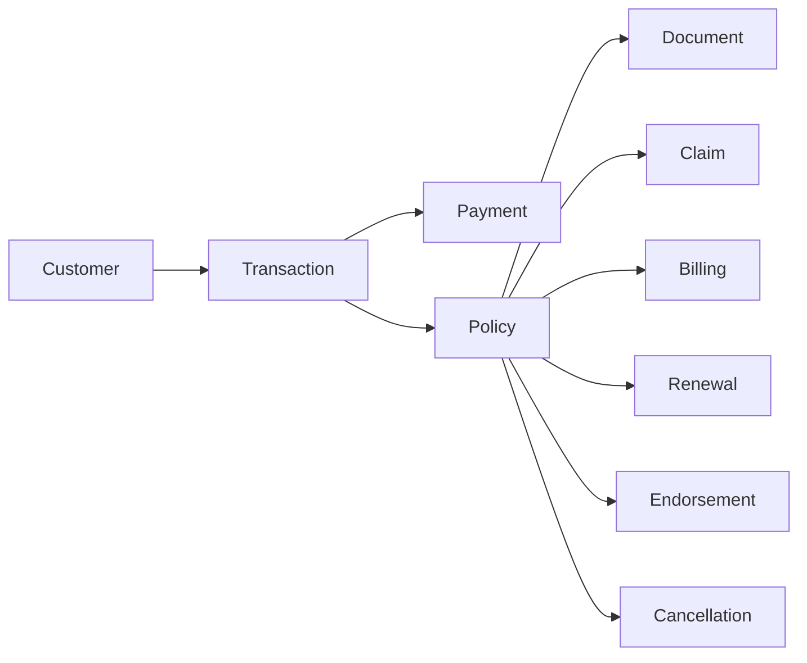

**Self-Care Integration**

Portal `Polis Saya / Klaim / Bantuan` adalah kelanjutan dari flow pembelian, bukan aplikasi terpisah. Titik masuknya ada setelah `PAIDOK` dan `GENERATE PDF FINAL`, sesuai flowchart Anda.

**Route Map**
- `Produk`: flow penawaran dan pembelian existing di `Web Automation`
- `Portal root`: `/portal`
- `Polis`: `/portal/policies`
- `Klaim`: `/portal/claims`
- `Bantuan`: `/portal/help`
- `Setelah pembayaran sukses`: redirect ke `/portal/policies/:policyId?entry=issued`

**Flow Mapping**


**Data Model**


**Entitas Minimum**
- `customer`
  - `id`
  - `name`
  - `email`
  - `phone`
- `transaction`
  - `id`
  - `productCode`
  - `quoteVersionId`
  - `status`
  - `paymentStatus`
- `policy`
  - `id`
  - `customerId`
  - `transactionId`
  - `productName`
  - `policyNumber`
  - `status`
  - `coverageStart`
  - `coverageEnd`
  - `sumInsured`
  - `totalPremium`
- `claim`
  - `id`
  - `policyId`
  - `status`
  - `lossDate`
  - `nextAction`
- `document`
  - `id`
  - `policyId`
  - `type`
  - `url`
- `billing`
  - `id`
  - `policyId`
  - `status`
  - `dueDate`
  - `amount`

**Adapter Yang Sudah Disiapkan**
Gunakan [selfCareIntegration.js](/D:/OD/RP/OneDrive%20-%20Asuransi%20Jasa%20Indonesia/Codex/property-prototype-app/src/platform/selfCareIntegration.js:1) untuk:
- memetakan policy terbit menjadi model portal
- memetakan claim menjadi model portal
- memetakan invoice menjadi billing portal
- menentukan route setelah pembelian sukses

**Contoh Integrasi**
```js
import PersonalPolicyPortal from "../../jasindo-customer-claims-portal/src/PersonalPolicyPortal.jsx";
import { buildPostPurchaseNavigation, buildSelfCarePortalModel } from "../platform/selfCareIntegration.js";

const portalModel = buildSelfCarePortalModel({
  customer,
  policies: issuedPolicies,
  claims: policyClaims,
  invoices: outstandingInvoices,
  defaultTab: "policies",
});

<PersonalPolicyPortal
  sessionName={portalModel.sessionName}
  policies={portalModel.policies}
  claims={portalModel.claims}
  billingItems={portalModel.billingItems}
  contacts={portalModel.contacts}
  defaultTab={portalModel.defaultTab}
/>
```

**Keputusan Integrasi**
- `Web Automation` tetap menjadi app utama
- `Portal Saya` ditanam sebagai module post-purchase
- data portal harus berasal dari sumber transaksi yang sama dengan flow pembelian
- dummy data di portal hanya fallback prototype, bukan sumber utama saat merge
